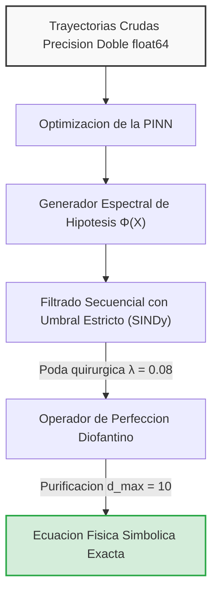

# Invariant Regression and Identification of Systems

Este framework presenta un marco metodológico formal para la identificación, aislamiento y destilación autónoma de ecuaciones diferenciales ordinarias acopladas y leyes algebraicas no lineales que gobiernan sistemas dinámicos complejos. 

El motor elude la opacidad y la falta de interpretabilidad de las arquitecturas de caja negra tradicionales mediante un pipeline neuro-simbólico: primero optimiza el espacio continuo del fenómeno y luego proyecta trayectorias sobre un espacio de características latentes de amplio espectro para extraer leyes físicas puras, exactas y legibles.

---

## Fundamento Matemático y Arquitectura del Motor

El flujo de procesamiento del sistema ejecuta una transformación rigurosa dividida en cuatro etapas secuenciales:



### 1. Generador Espectral de Hipótesis $\Phi(X)$

Dado un tensor de variables de estado de entrada $\mathbf{X}$ en formato de matriz de dos dimensiones (donde las filas representan el tamaño del lote de procesamiento y las columnas la dimensionalidad del espacio observable), el operador realiza un mapeo no lineal multidimensional. Su objetivo es expandir de forma ciega el universo de hipótesis candidatas a una dimensión hiperdeterminada mucho mayor que la inicial.

La matriz de diseño global se construye mediante la partición y concatenación horizontal de tres sub-bibliotecas algebraicas ortogonales:

* **Sub-biblioteca Polinomial Espacial ($\Phi_{\text{poly}}$):** Modela los términos de acoplamiento lineal y las aproximaciones locales de Taylor hasta tercer grado:
* Términos lineales: $x_i$
* Términos cuadráticos cruzados: $x_i \cdot x_j$
* Términos cúbicos complejos: $x_i \cdot x_j \cdot x_k$


* **Sub-biblioteca de Inversos Racionales y Singularidades ($\Phi_{\text{inv}}$):** Diseñada específicamente para capturar decaimientos asintóticos y singularidades dinámicas severas en sistemas de fuerzas centrales donde el operador experimenta divergencias críticas cuando la distancia relativa tiende a cero. Incorpora un estabilizador numérico $\varepsilon = 10^{-15}$ para blindar el algoritmo contra indeterminaciones de división por cero:
* Inversos simples y potencias: $\frac{1}{x_i}, \frac{1}{x_i^2}, \frac{1}{x_i^3}$
* Cocientes acoplados complejos: $\frac{x_i}{x_j^2}, \frac{x_i}{x_j^3}$


* **Sub-biblioteca Trigonométrica Espectral ($\Phi_{\text{trig}}$):** Provee las funciones de base necesarias para el aislamiento de componentes angulares y oscilaciones armónicas periódicas:
* Funciones base: $\sin(x_i), \cos(x_i)$


El espacio espectral unificado se consolida bajo la estructura matricial:


$$\Phi(X) = [ \Phi_{\text{poly}} \parallel \Phi_{\text{inv}} \parallel \Phi_{\text{trig}} ]$$

### 2. Filtrado Secuencial con Umbral Estricto (SINDy)

La composición de los coeficientes globales mediante la resolución directa de la ecuación normal de mínimos cuadrados es numéricamente inestable. La inclusión simultánea de potencias superiores, inversos y funciones trigonométricas genera una matriz de diseño con una multicolinealidad extrema, provocando que el determinante de la matriz tienda a cero y destruyendo la precisión de la inversión.

Para neutralizar esta patología, el motor ejecuta una poda quirúrgica iterativa regulada por un hiperparámetro de corte estricto $\lambda = 0.08$. En cada iteración:

1. El optimizador evalúa los pesos actuales y restringe el dominio del problema exclusivamente al conjunto de índices de características activas, es decir, aquellas cuyo valor absoluto supera o iguala a $\lambda$.
2. Se recalculan los mínimos cuadrados únicamente sobre las columnas supervivientes.

Al extinguir de forma iterativa las columnas que no aportan varianza explicativa real a la derivada temporal, la matriz se acondiciona instantáneamente, recuperando su rango completo y estabilizando los estimadores algebraicos.

### 3. Operador de Perfección Decimal Racional

Con el objetivo de erradicar los residuos numéricos espurios inducidos por la aritmética de punto flotante del hardware, los pesos continuos optimizados se someten a un mapeo diofantino formal a través de fracciones continuas limitadas.

Fijando el denominador máximo admisible de forma estricta a $d_{\text{max}} = 10$, este procedimiento purifica el coeficiente numérico (por ejemplo, transformando un peso ruidoso de $-0.99999997$ a la fracción exacta $-1/1$). Esto remueve las aproximaciones decimales flotantes y garantiza la interpretabilidad teórica de la ley física descubierta.

---

## Bitácora de Diseño Numérico Anti-Fallos

Durante el ciclo de desarrollo empírico del framework, se identificaron y neutralizaron dos fallos sistémicos en el procesamiento de datos, los cuales quedaron establecidos como principios mandatorios de diseño:

1. **Preservación de Magnitudes Crudas (Abandono de MinMax):** La implementación inicial de escalados lineales tipo MinMax sobre la matriz de entrada alteraba las tasas de cambio locales de las variables de estado, rompiendo la homogeneidad dimensional de las leyes y fijando el error de la norma infinita en un intolerable $L_{\infty} = 0.2104$. Se determinó como principio fundamental que las variables deben conservar estrictamente sus magnitudes físicas crudas.
2. **Mitigación de Cancelación Catastrófica (Uso Mandatorio de float64):** El uso de tipados estándar `float32` limitaba la mantisa del procesador a 24 bits de almacenamiento físico (lo que se traduce en apenas 7 dígitos significativos). Al evaluar cocientes acoplados con denominadores cúbicos disminuidos, el truncamiento del bit marginal amplificaba el residuo asintóticamente. La migración estructural hacia tensores homogéneos de doble precisión de **64 bits (float64)** extendió la capacidad de la mantisa a 53 bits, confinando el error al límite del redondeo de hardware e incrementando drásticamente la precisión general.

---

## Estructura del Proyecto

* `main.py`: Orquestador principal de la interfaz de terminal interactiva, carga de datos en alta precisión y ejecución del pipeline.
* `src/logger.py`: Módulo de registro analítico integrado con formatos visuales avanzados.
* `src/logic_loss.py`: Función de pérdida lógica e informada (RILLLoss) para guiar el aprendizaje de la red neuronal en espacios continuos.
* `src/pinn_factory.py`: Arquitectura de la Red Neuronal Informada por la Física construida nativamente en `float64`.
* `src/symbolic_engine.py`: Núcleo del motor simbólico (Construcción espectral $\Phi(X)$, filtrado SINDy con $\lambda = 0.08$ y purificación por fracciones continuas).
* `src/distiller.py`: Extractor encargado de interrogar a la red neuronal mediante una evaluación masiva en el espacio latente y exportar las leyes purificadas a scripts de código independientes.

---

## Instrucciones de Uso y CLI en Terminal

### 1. Instalación de Dependencias

Asegúrate de instalar los requerimientos oficiales del sistema:

```bash
pip install -r requirements.txt

```

### 2. Carga de Datos

El framework busca datasets estructurados dentro de la carpeta `data/`. Cada archivo debe ser un `.csv` donde las primeras columnas correspondan a las variables dinámicas de estado independientes y la última columna sea la variable objetivo (o derivada temporal) que se desea modelar.

### 3. Ejecución Interactiva

Lanza el motor ejecutando en tu terminal:

```bash
python main.py

```

Al iniciar, se desplegará una interfaz avanzada en la interfaz de comandos con las siguientes características:

* **Selección Interactiva:** El sistema escaneará la carpeta `data/` y te presentará una tabla formateada con los datasets dinámicos disponibles para elegir mediante su índice.
* **Inyección Lógica:** Te preguntará interactivamente si deseas activar el operador de pérdida RILL.
* **Monitoreo en Tiempo Real:** Una barra de progreso animada te mostrará el avance detallado de la optimización de los gradientes continuos de la red neuronal y el estado de la pérdida (*Loss*).
* **Bloque de Resultados:** Tras finalizar la destilación simbólica, se imprimirá un panel detallado que muestra la ecuación matemática exacta descubierta, el error supremo ($L_{\infty}$) alcanzado y las rutas donde se guardaron automáticamente el reporte formal en LaTeX (`.tex`) y el script ejecutable en Python (`formula.py`).
